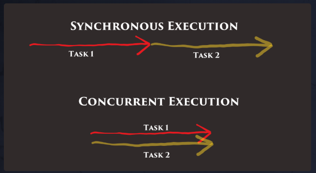

# Concurrency

# What Is Concurrency?
Concurrency is the ability to perform multiple tasks at the same time. Typically, our code is executed one line at a time, one after the other. This is called sequential execution or synchronous execution.

If the computer we're running our code on has multiple cores, we can even execute multiple tasks at exactly the same time. If we're running on a single core, a single core executes code at almost the same time by switching between tasks very quickly. Either way, the code we write looks the same in Go and takes advantage of whatever resources are available.

# How Does Concurrency Work in Go?
Go was designed to be concurrent, which is a trait fairly unique to Go. It excels at performing many tasks simultaneously safely using a simple syntax.

There isn't a popular programming language in existence where spawning concurrent execution is quite as elegant, at least in my opinion.

Concurrency is as simple as using the go keyword when calling a function:

go doSomething()

In the example above, doSomething() will be executed concurrently with the rest of the code in the function. The go keyword is used to spawn a new goroutine.

# Channels
Channels are a typed, thread-safe queue. Channels allow different goroutines to communicate with each other.

## Create a Channel
Like maps and slices, channels must be created before use. They also use the same make keyword:

ch := make(chan int)

## Send Data to a Channel
ch <- 69

The <- operator is called the channel operator. Data flows in the direction of the arrow. This operation will block until another goroutine is ready to receive the value.

## Receive Data from a Channel
v := <-ch

This reads and removes a value from the channel and saves it into the variable v. This operation will block until there is a value in the channel to be read.

# Blocking and Deadlocks
A deadlock is when a group of goroutines are all blocking so none of them can continue. This is a common bug that you need to watch out for in concurrent programming.

# waiting for tokens (empty structs) on a channel.

Empty structs are often used as a unary value. Sometimes, we don't care what is passed through a channel. We care when and if it is passed.

We can block and wait until something is sent on a channel using the following syntax

<-ch

This will block until it pops a single item off the channel, then continue, discarding the item.

go func() {
		for i := 0; i < numDBs; i++ {
			ch <- struct{}{}
			fmt.Printf("Database %v is online\n", i+1)
			count++
		}
	}()

    for i := 0; i < numDBs; i++ {
		<-dbChan
	}

# Buffered Channels
Channels can optionally be buffered.

Creating a Channel With a Buffer
You can provide a buffer length as the second argument to make() to create a buffered channel:

ch := make(chan int, 100)

A buffer allows the channel to hold a fixed number of values before sending blocks. This means sending on a buffered channel only blocks when the buffer is full, and receiving blocks only when the buffer is empty.

# Closing Channels in Go
Channels can be explicitly closed by a sender:

ch := make(chan int)

// do some stuff with the channel

close(ch)

# Checking If a Channel Is Closed
Similar to the ok value when accessing data in a map, receivers can check the ok value when receiving from a channel to test if a channel was closed.

v, ok := <-ch

ok is false if the channel is empty and closed.

# Don't Send on a Closed Channel
Sending on a closed channel will cause a panic. A panic on the main goroutine will cause the entire program to crash, and a panic in any other goroutine will cause that goroutine to crash.

Closing isn't necessary. There's nothing wrong with leaving channels open, they'll still be garbage collected if they're unused. You should close channels to indicate explicitly to a receiver that nothing else is going to come across.

# Range
Similar to slices and maps, channels can be ranged over.

for item := range ch {
    // item is the next value received from the channel
}

This example will receive values over the channel (blocking at each iteration if nothing new is there) and will exit only when the channel is closed.

# Select
Sometimes we have a single goroutine listening to multiple channels and want to process data in the order it comes through each channel.

A select statement is used to listen to multiple channels at the same time. It is similar to a switch statement but for channels.

select {
case i, ok := <- chInts:
    fmt.Println(i)
case s, ok := <- chStrings:
    fmt.Println(s)
}

The first channel with a value ready to be received will fire and its body will execute. If multiple channels are ready at the same time one is chosen randomly. The ok variable in the example above refers to whether or not the channel has been closed by the sender yet.

# Select Default Case
The default case in a select statement executes immediately if no other channel has a value ready. A default case stops the select statement from blocking.

select {
case v := <-ch:
    // use v
default:
    // receiving from ch would block
    // so do something else
}

# Tickers
time.Tick() is a standard library function that returns a channel that sends a value on a given interval.
time.After() sends a value once after the duration has passed.
time.Sleep() blocks the current goroutine for the specified duration of time.
The functions take a time.Duration as an argument. For example:

time.Tick(500 * time.Millisecond)

If you don't add time.Millisecond (or another unit), it will default to nanoseconds. That's — taking a wild guess here — probably faster than you want it to be.

# Read-Only Channels
A channel can be marked as read-only by casting it from a chan to a <-chan type. For example:

func main() {
    ch := make(chan int)
    readCh(ch)
}

func readCh(ch <-chan int) {
    // ch can only be read from
    // in this function
}

# Write-Only Channels
The same goes for write-only channels, but the arrow's position moves.

func writeCh(ch chan<- int) {
    // ch can only be written to
    // in this function
}

# Channels Review
Here are a few extra things you should understand about channels from Dave Cheney's awesome article.

https://dave.cheney.net/2014/03/19/channel-axioms

A Declared but Uninitialized Channel Is Nil Just Like a Slice
var s []int       // s is nil
var c chan string // c is nil

var s = make([]int, 5) // s is initialized and not nil
var c = make(chan int) // c is initialized and not nil

# A Send to a Nil Channel Blocks Forever
var c chan string        // c is nil
c <- "let's get started" // blocks

# A Receive from a Nil Channel Blocks Forever
var c chan string // c is nil
fmt.Println(<-c)  // blocks

# A Send to a Closed Channel Panics
var c = make(chan int, 100)
close(c)
c <- 1 // panic: send on closed channel

# A Receive from a Closed Channel Returns the Zero Value Immediately
var c = make(chan int, 100)
close(c)
fmt.Println(<-c) // 0