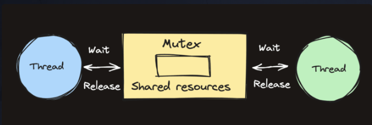

# Mutexes in Go
Mutexes allow us to lock access to data. This ensures that we can control which goroutines can access certain data at which time.

Go's standard library provides a built-in implementation of a mutex with the sync.Mutex type and its two methods:

1. .Lock()
2. .Unlock()

We can protect a block of code by surrounding it with a call to Lock and Unlock as shown on the protected() method below.

It's good practice to structure the protected code within a function so that defer can be used to ensure that we never forget to unlock the mutex.

func protected(){
    mu.Lock()
    defer mu.Unlock()
    // the rest of the function is protected
    // any other calls to `mu.Lock()` will block
}

Mutexes are powerful. Like most powerful things, they can also cause many bugs if used carelessly.

# Maps Are Not Thread-Safe
Maps are not safe for concurrent use! If you have multiple goroutines accessing the same map, and at least one of them is writing to the map, you must lock your maps with a mutex.

Mutex is short for mutual exclusion, and the conventional name for the data structure that provides it is "mutex", often abbreviated to "mu".

It's called "mutual exclusion" because a mutex excludes different threads (or goroutines) from accessing the same data at the same time.

# Mutex Review
The principal problem that mutexes help us avoid is the concurrent read/write problem. This problem arises when one thread is writing to a variable while another thread is reading from that same variable at the same time.

When this happens, a Go program will panic because the reader could be reading bad data while it's being mutated in place.

Mutex Example
package main

import (
	"fmt"
)

func main() {
	m := map[int]int{}
	go writeLoop(m)
	go readLoop(m)

	// stop program from exiting, must be killed
	block := make(chan struct{})
	<-block
}

func writeLoop(m map[int]int) {
	for {
		for i := 0; i < 100; i++ {
			m[i] = i
		}
	}
}

func readLoop(m map[int]int) {
	for {
		for k, v := range m {
			fmt.Println(k, "-", v)
		}
	}
}

The example above creates a map, then starts two goroutines which each have access to the map. One goroutine continuously mutates the values stored in the map, while the other prints the values it finds in the map.

If we run the program on a multi-core machine, we get the following output: fatal error: concurrent map iteration and map write

In Go, it isn’t safe to read from and write to a map at the same time.

Mutexes to the Rescue
package main

import (
	"fmt"
	"sync"
)

func main() {
	m := map[int]int{}

	mu := &sync.Mutex{}

	go writeLoop(m, mu)
	go readLoop(m, mu)

	// stop program from exiting, must be killed
	block := make(chan struct{})
	<-block
}

func writeLoop(m map[int]int, mu *sync.Mutex) {
	for {
		for i := 0; i < 100; i++ {
			mu.Lock()
			m[i] = i
			mu.Unlock()
		}
	}
}

func readLoop(m map[int]int, mu *sync.Mutex) {
	for {
		mu.Lock()
		for k, v := range m {
			fmt.Println(k, "-", v)
		}
		mu.Unlock()
	}
}

# RW Mutex
The standard library also exposes a sync.RWMutex

In addition to these methods:

Lock()
Unlock()
The sync.RWMutex also has these methods for concurrent reads:

RLock()
RUnlock()

The sync.RWMutex improves performance in read-intensive processes. Multiple goroutines can safely read from the map simultaneously, as many RLock() calls can occur at the same time. However, only one goroutine can hold a Lock(), and during this time, all RLock() operations are blocked.

# Read/Write Mutex Review
Maps are safe for concurrent read access, just not concurrent read/write or write/write access. A read/write mutex allows all the readers to access the map at the same time, but a writer will still lock out all other readers and writers.

package main

import (
	"fmt"
	"sync"
)

func main() {
	m := map[int]int{}

	mu := &sync.RWMutex{}

	go writeLoop(m, mu)
	go readLoop(m, mu)
	go readLoop(m, mu)
	go readLoop(m, mu)
	go readLoop(m, mu)

	// stop program from exiting, must be killed
	block := make(chan struct{})
	<-block
}

func writeLoop(m map[int]int, mu *sync.RWMutex) {
	for {
		for i := 0; i < 100; i++ {
			mu.Lock()
			m[i] = i
			mu.Unlock()
		}
	}
}

func readLoop(m map[int]int, mu *sync.RWMutex) {
	for {
		mu.RLock()
		for k, v := range m {
			fmt.Println(k, "-", v)
		}
		mu.RUnlock()
	}
}

By using a sync.RWMutex, our program becomes more efficient. We can have as many readLoop() threads as we want, while still ensuring that the writers have exclusive access.