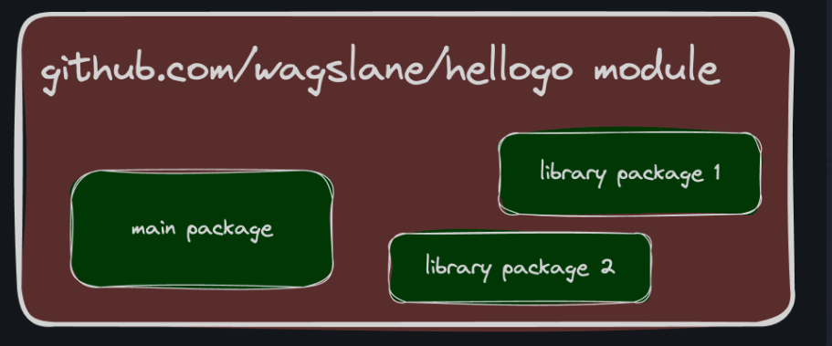

# Pcakages and Modules

# Packages
Every Go program is made up of packages.

You have probably noticed the package main at the top of all the programs you have been writing.

A package named "main" has an entrypoint at the main() function. A main package is compiled into an executable program.

A package by any other name is a "library package". Libraries have no entry point. Libraries simply export functionality that can be used by other packages. For example:

package main

import (
	"fmt"
	"math/rand"
)

func main() {
	fmt.Println("My favorite number is", rand.Intn(10))
}

# Package Naming
By convention, a package's name is the same as the last element of its import path. For instance, the math/rand package comprises files that begin with:

package rand

That said, package names aren't required to match their import path. For example, I could write a new package with the path github.com/mailio/rand and name the package random:

package random

While the above is possible, it is discouraged for the sake of consistency.

# One Package / Directory
A directory of Go code can have at most one package. All .go files in a single directory must all belong to the same package. If they don't, an error will be thrown by the compiler. This is true for main and library packages alike.

# Modules
Go programs are organized into packages. A package is a directory of Go code that's all compiled together. Functions, types, variables, and constants defined in one source file are visible to all other source files within the same package (directory).

A repository contains one or more modules. A module is a collection of Go packages that are released together.

# One Module Per Repo (Usually)
A file named go.mod at the root of a project declares the module. It contains:

The module path
The version of the Go language your project requires
Optionally, any external package dependencies your project has
The module path is just the import path prefix for all packages within the module. Here's an example of a go.mod file:

module github.com/bootdotdev/exampleproject

go 1.23.0

require github.com/google/examplepackage v1.3.0

Each module's path not only serves as an import path prefix for the packages within but also indicates where the go command should look to download it. For example, to download the module golang.org/x/tools, the go command would consult the repository located at https://golang.org/x/tools.

An "import path" is a string used to import a package. A package's import path is its module path joined with its subdirectory within the module. For example, the module github.com/google/go-cmp contains a package in the directory cmp/. That package's import path is github.com/google/go-cmp/cmp. Packages in the standard library do not have a module path prefix.

# Only GitHub?
You don't need to publish your code to a remote repository before you can build it. A module can be defined locally without belonging to a remote repository. However, it's a good habit to keep a copy of all your projects on some remote server, like GitHub.

# First Local Program
Once inside your personal workspace, create a new directory and enter it:

mkdir hellogo
cd hellogo

Inside the directory declare your module's name:
go mod init {REMOTE}/{USERNAME}/hellogo

Where {REMOTE} is your preferred remote source provider (i.e. github.com) and {USERNAME} is your Git username. If you don't use a remote provider yet, just use example.com/username/hellogo

Print your go.mod file:
cat go.mod

# Go Run
The go run command quickly compiles and runs a Go package. The compiled binary is not saved in your working directory.

I typically use go run to do local testing, scripting and debugging.

# Go Build
The go build command compiles go code into a single, statically linked executable program. One of the beauties of Go is that you always go build for production, and because the output is a statically compiled binary, you can ship it to production or end users without them needing the Go toolchain installed.

Some new Go devs use go run on a server in production, which is a huge mistake.

Ensure you are in your hellogo repo, then run:
go build

Run the new program:
./hellogo

# Go Install
The go install command compiles and installs a package or packages on your local machine for your personal usage. It installs the package's compiled binary in the GOBIN directory

Assignment
Ensure you are in your hellogo repo, then run:
go install

Navigate out of your project directory:
cd ../

If all went well, Go compiled and installed the hellogo program globally on your machine. Run it with:
hellogo

# Functions in Packages

Note: Only capitalized names are exported, meaning they can be accessed by other packages. Uncapitalized names are private.

# A Note on “replace”
Be aware that using the "replace" keyword like we did in the last assignment is not advised, but can be useful to get up and running quickly. The proper way to create and depend on modules is to publish them to a remote repository. When you do that, the "replace" keyword can be dropped from the go.mod:

This only works for local-only development:

replace github.com/wagslane/mystrings v0.0.0 => ../mystrings

# Remote Packages
go get github.com/wagslane/go-tinytime

# Clean Packages

1. Hide Internal Logic
If you're familiar with the pillars of OOP, this is a practice in encapsulation.

Oftentimes an application will have complex logic that requires a lot of code. In almost every case the logic that the application cares about can be exposed via an API, and most of the dirty work can be kept within a package. For example, imagine we are building an application that needs to classify images. We could build a package:

package classifier

// ClassifyImage classifies images as "hotdog" or "not hotdog"
func ClassifyImage(image []byte) (imageType string) {
	if hasHotdogColors(image) && hasHotdogShape(image) {
		return "hotdog"
	} else {
		return "not hotdog"
	}
}

func hasHotdogShape(image []byte) bool {
	// internal logic that the application doesn't need to know about
	return true
}

func hasHotdogColors(image []byte) bool {
	// internal logic that the application doesn't need to know about
	return true
}

We create an API by only exposing the function(s) that the application-level needs to know about. All other logic is unexported to keep a clean separation of concerns. The application doesn’t need to know how to classify an image, just the result of the classification.

2. Don’t Change APIs
The unexported functions within a package can and should change often for testing, refactoring, and bug fixing.

A well-designed library will have a stable API so that users don't get breaking changes each time they update the package version. In Go, this means not changing exported function’s signatures.

3. Don’t Export Functions from the Main Package
A main package isn't a library, there's no need to export functions from it.

4. Packages Shouldn't Know About Dependents
Perhaps one of the most important and most broken rules is that a package shouldn’t know anything about its dependents. In other words, a package should never have specific knowledge about a particular application that uses it.