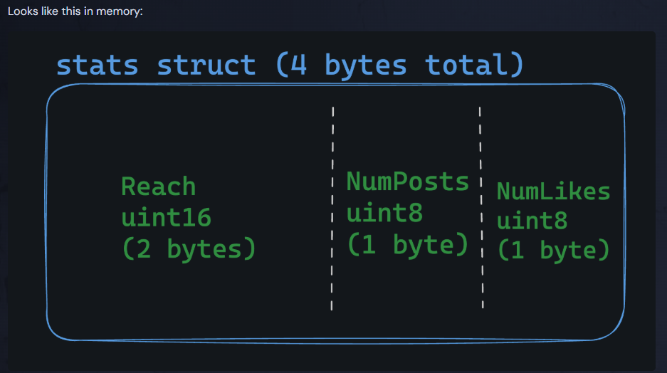
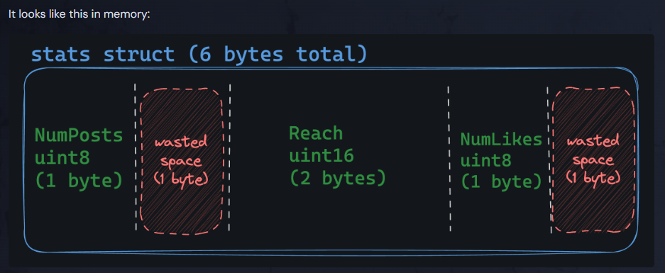
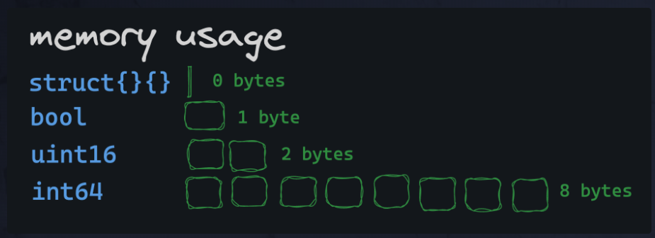

# Structs in Go
We use structs in Go to represent structured data. It’s often convenient to group different types of variables together. For example, if we want to represent a car we could do the following:

type car struct {
	brand      string
	model      string
	doors      int
	mileage    int
}

# Nested Structs in Go
Structs can be nested to represent more complex entities:

type car struct {
  brand string
  model string
  doors int
  mileage int
  frontWheel wheel
  backWheel wheel
}

type wheel struct {
  radius int
  material string
}

The fields of a struct can be accessed using the dot . operator.

myCar := car{}
myCar.frontWheel.radius = 5

# Anonymous Structs in Go
An anonymous struct is just like a normal struct, but it is defined without a name and therefore cannot be referenced elsewhere in the code.

To create an anonymous struct, just instantiate the instance immediately using a second pair of brackets after declaring the type:

myCar := struct {
  brand string
  model string
} {
  brand: "Toyota",
  model: "Camry",
}

You can even nest anonymous structs as fields within other structs:

type car struct {
  brand string
  model string
  doors int
  mileage int
  // wheel is a field containing an anonymous struct
  wheel struct {
    radius int
    material string
  }
}

# Embedded Structs
Go is not an object-oriented language. However, embedded structs provide a kind of data-only inheritance that can be useful at times. Keep in mind, Go doesn’t support classes or inheritance in the complete sense, but embedded structs are a way to elevate and share fields between struct definitions.

type car struct {
  brand string
  model string
}

type truck struct {
  // "car" is embedded, so the definition of a
  // "truck" now also additionally contains all
  // of the fields of the car struct
  car
  bedSize int
}

# Embedded vs. Nested
Unlike nested structs, an embedded struct’s fields are accessed at the top level like normal fields.
Like nested structs, you assign the promoted fields with the embedded struct in a composite literal.
lanesTruck := truck{
  bedSize: 10,
  car: car{
    brand: "Toyota",
    model: "Camry",
  },
}

fmt.Println(lanesTruck.brand) // Toyota
fmt.Println(lanesTruck.model) // Camry

In the example above you can see that both brand and model are accessible from the top-level, while the nested equivalent to this object would require you to access these fields via a nested car struct: lanesTruck.car.brand or lanesTruck.car.model.

# Struct Methods in Go
While Go is not object-oriented, it does support methods that can be defined on structs. Methods are just functions that have a receiver. A receiver is a special parameter that syntactically goes before the name of the function.

type rect struct {
  width int
  height int
}

// area has a receiver of (r rect)
// rect is the struct
// r is the placeholder
func (r rect) area() int {
  return r.width * r.height
}

var r = rect{
  width: 5,
  height: 10,
}

fmt.Println(r.area())
// prints 50

A receiver is just a special kind of function parameter. In the example above, the r in (r rect) could just as easily have been rec or even x, y or z. By convention, Go code will often use the first letter of the struct’s name.

Receivers are important because they will, as you’ll learn in the exercises to come, allow us to define interfaces that our structs (and other types) can implement.

# Memory Layout
In Go, structs sit in memory in a contiguous block, with fields placed one after another as defined in the struct. For example this struct:

type stats struct {
	Reach    uint16
	NumPosts uint8
	NumLikes uint8
}

## Field ordering… Matters?
the order of fields in a struct can have a big impact on memory usage. This is the same struct as above, but poorly designed:

type stats struct {
	NumPosts uint8
	Reach    uint16
	NumLikes uint8
}

Notice that Go has “aligned” the fields, meaning that it has added some padding (wasted space) to make up for the size difference between the uint16 and uint8 types. It’s done for execution speed, but it can lead to increased memory usage.

## Should I Panic?
To be honest, you should not stress about memory layout. However, if you have a specific reason to be concerned about memory usage, aligning the fields by size (largest to smallest) can help. You can also use the reflect package to debug the memory layout of a struct:

typ := reflect.TypeOf(stats{})
fmt.Printf("Struct is %d bytes\n", typ.Size())

## Real Story
I once had a server in production that held a lot of structs in memory. Like hundreds of thousands in a list. When I re-ordered the fields in the struct, the memory usage of the program dropped by over 2 gigabytes! It was a huge performance win.

# Empty Struct
Empty structs are used in Go as a unary value.

// anonymous empty struct type
empty := struct{}{}

// named empty struct type
type emptyStruct struct{}
empty := emptyStruct{}

the cool thing about empty structs is that they’re the smallest possible type in Go: they take up zero bytes of memory.

